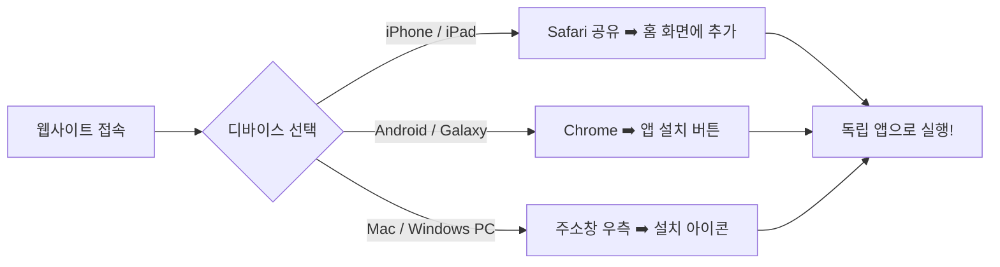

# 🎳 ProDrill Tools 공식 사용 설명서 (User Manual)

> **ProDrill Tools**는 볼링 지공사를 위한 **초정밀 스판 변환 및 멀티 드릴 오발(Oval) 피치 연산 전문 툴킷**입니다.
> 웹 브라우저는 물론, 모바일과 PC에서 설치형 앱(PWA)으로 언제 어디서나 오프라인에서도 즉시 사용할 수 있습니다.

* **공식 웹 주소**: [https://drilling-tools-app.vercel.app](https://drilling-tools-app.vercel.app)

---

## 📱 1. 디바이스별 앱 설치 가이드 (PWA 홈 화면 추가)

ProDrill Tools는 앱스토어 다운로드 없이 웹 브라우저에서 **단 3초 만에 독립 앱으로 설치**하여 전체 화면으로 쾌적하게 사용할 수 있습니다.



---

### ① iPhone / iPad (iOS Safari)
1. **Safari 브라우저**로 [`https://drilling-tools-app.vercel.app`](https://drilling-tools-app.vercel.app)에 접속합니다.
2. 화면 하단 중앙의 **[공유 버튼 (네모 위 화살표 ↑)]**을 누릅니다.
3. 메뉴를 아래로 스크롤하여 **[홈 화면에 추가]**를 선택합니다.
4. 우측 상단의 **[추가]**를 누르면 스마트폰 바탕화면에 ProDrill Tools 앱 아이콘이 생성됩니다.

---

### ② 안드로이드 스마트폰 (Galaxy / Chrome / 삼성 인터넷)
1. **Chrome 브라우저** 또는 **삼성 인터넷**으로 사이트에 접속합니다.
2. 화면 하단에 나타나는 **[홈 화면에 ProDrill Tools 추가]** 배너를 누르거나,
3. 브라우저 우측 상단 **[더보기 (점 3개 ⋮)]** ➡️ **[앱 설치]** 또는 **[홈 화면에 추가]**를 누릅니다.

---

### ③ Mac / Windows PC (데스크탑)
1. **Chrome** 또는 **Microsoft Edge** 브라우저로 사이트에 접속합니다.
2. 상단 주소창 맨 오른쪽의 **[컴퓨터 모니터 모양(설치) 아이콘 💻]** 또는 **[다운로드 화살표]**를 클릭합니다.
3. **[설치]**를 클릭하면 독립된 데스크탑 앱 창으로 실행되며, Dock 또는 바탕화면에 등록됩니다.

---

## 🔄 2. 스판 변환기 (Span Converter)

> **그립 방식과 측정 기준에 따른 다양한 스판 수치를 0.001초 만에 100% 정밀 상호 변환**합니다.

```
[입력 스판 제원] ──▶ [수학적 곡면 연산] ──▶ [Edge-to-Edge / Center-to-Center / Cut-to-Cut / Actual Span 동시 도출]
```

### 📋 주요 사용 순서
1. **손잡이 방향 선택**: 상단에서 **[오른손]** 또는 **[왼손]**을 선택합니다.
2. **기준 스판 입력**:
   * 중지(Middle) 및 약지(Ring) 스판 값을 내장된 **[분수 키패드]**를 통해 원터치로 입력합니다 (예: `4 1/4`, `4 5/16`).
   * 측정 기준(Edge to Edge, Center to Center, Cut to Cut 등)을 선택합니다.
3. **브릿지 및 홀 제원 입력**:
   * 브릿지(Bridge) 간격, 인서트 사용 여부, 중/약지 홀 크기, 피치(Vertical, Lateral)를 지정합니다.
4. **[스판 변환] 버튼 클릭**:
   * 모든 측정 기준별 환산 수치가 한눈에 비교 정리되어 표시됩니다.
5. **[마킹 가이드] 확인**:
   * 볼 표면에 실제 지공 라인을 그릴 때 필요한 **Cut to Cut 실측 마킹 수치**와 도면 가이드를 제공합니다.

---

## 🎯 3. 오발 계산기 (Oval Calculator)

> **타원형 엄지홀(Oval Hole) 가공 시, 지공사가 원하는 각도와 크기에 맞춰 각 드릴 비트의 정밀 피치 이동값을 자동으로 연산**해 주는 특허급 핵심 엔진입니다.

```
[엄지 제원 입력]
- 피치 4방향 (◀, ▶, ▼, ▲)
- 원홀 크기 (Hole)
- 오발 크기 (Oval)
- 오발컷 #1 / #2
- 오발 각도 (Angle)
       │
       ▼
[AI 추천 엔진 가동] ──▶ 가공 거리(L_max) 기반 최적 드릴수 자동 산출
       │
       ▼
[결과 매트릭스 & 시뮬레이터]
- 3드릴 (기본) / 5드릴 (정밀) / 7드릴 (초정밀)
- 각 드릴 비트별 세부 가공 피치 및 지공기 D-Pad 오프셋 수치
- 실시간 2D 도면 시뮬레이터 (순백색 면 채우기)
- 1:1 실사이즈 도면 뷰 (◎)
```

---

### 📌 세부 입력 항목 안내

| 항목명 | 설명 | 입력 팁 |
| :--- | :--- | :--- |
| **엄지 피치** | `Left (◀)`, `Right (▶)`, `Reverse (▼)`, `Forward (▲)` | 엄지 기본 피치를 선택합니다. 한쪽 축이 0이면 반대쪽을 비워둡니다. |
| **원홀 (Hole)** | 기본 파일럿 홀(원형 드릴) 크기 | 예: `31/32`, `1` 등 기본 드릴 비트 크기를 선택합니다. |
| **오발 크기 (Oval)** | 최종 완성될 타원의 긴 지름 크기 | 원홀 크기 이상의 드롭다운 수치 중 선택합니다. |
| **오발컷 #1 / #2** | 타원형 확장에 사용할 컷팅 드릴 비트 크기 | #1 선택 시 #2가 자동 동기화되며, 필요 시 #2를 개별 변경할 수 있습니다. |
| **오발 각도 (Angle)** | 타원의 기울기 각도 (0° ~ 90°) | 지공할 오발 각도를 숫자로 입력합니다 (예: `45`, `60`). |

> 💡 **황색 알림 안내**: 아직 입력되지 않은 필수 항목은 연한 황색(`bg-amber-50`)으로 표시되어 누락된 부분을 한눈에 찾을 수 있습니다.

---

### 🌟 특별한 핵심 기능 (Exclusive Features)

#### ① 최적 정밀도 드릴 수 자동 추천
* 원홀과 오발 크기 차이로 발생하는 **최대 가공 이동 거리($L_{\max}$)**를 실시간 분석합니다.
* 가공량에 따라 가장 매끄러운 홀 형태를 완성할 수 있는 **3드릴 (기본)**, **5드릴 (정밀)**, **7드릴 (초정밀)** 중 최적 모드를 자동으로 추천 배지(`[추천 ✓]`)로 제시합니다.

#### ② 오발 피치 매트릭스 (Oval Pitch Matrix)
* 지공기 테이블을 어느 방향으로 얼마만큼 움직여야 하는지 **D-Pad 수평/수직 이동 오프셋(Offset)**과 **비트별 최종 피치값**을 1/64인치 단위 분수 및 소수점으로 정확히 제공합니다.

#### ③ 실시간 2D 도면 시뮬레이터 & 실사이즈 뷰(◎)
* **[도면] 탭**: 가공 비트들이 겹쳐지며 완성되는 타원 홀의 형상을 **순백색 면 채우기 시뮬레이션**으로 시각화합니다.
* **1:1 실사이즈 보기 `[ ◎ ]` 버튼**: 모바일 화면에 실제 볼링공 엄지홀과 **1:1 실제 치수(Real Scale)**로 렌더링되어, 실물 인서트나 엄지를 화면에 직접 대보고 크기를 가늠할 수 있습니다.
* **에딧 모드(Edit Mode)**: 비트 규격을 변경하거나 오프셋을 미세 조정할 수 있으며, 최대 8드릴(#8)까지 자유롭게 확장 가능합니다.

---

## 💾 4. 아카이브 (Archive) 및 공유 기능

### ① 제원 저장
* 계산된 오발 피치 결과 화면 하단의 **[아카이브 저장]** 버튼을 누르고 고객명 또는 볼 이름을 입력하면 로컬 저장소에 영구 보관됩니다.

### ② 원클릭 카카오톡 / 문자 공유
* 저장된 기록에서 **[공유]** 버튼을 누르면:
  * **텍스트 피치표 복사**: 드릴 비트별 피치 수치와 D-Pad 가공 가이드가 깔끔한 표 양식으로 클립보드에 복사되어 카카오톡, 문자, 밴드 등에 바로 붙여넣기 할 수 있습니다.
  * **TXT 파일 다운로드**: 텍스트 문서로 저장하여 인쇄하거나 PC에 보관할 수 있습니다.

---

## ⚡ 5. 자주 묻는 질문 (FAQ)

**Q. 인터넷 연결이 없어도 사용할 수 있나요?**
> **A. 네, 100% 가능합니다!** 홈 화면에 추가(PWA 설치)해 두시면 인터넷이나 Wi-Fi가 없는 볼링장 지공실 지하에서도 완벽하게 모든 계산과 도면 시뮬레이터가 정상 구동됩니다.

**Q. 분수 입력은 어떻게 하나요?**
> **A. 전용 분수 키패드가 탑재되어 있습니다.** 숫자와 분수 버튼(`1/2`, `1/4`, `1/8`, `1/16`, `1/32`, `1/64`)을 터치하여 `4-1/4` 등의 지공 치수를 오타 없이 빠르게 입력할 수 있습니다.

**Q. 데이터를 초기화하고 싶어요.**
> **A. 상단 우측의 `[초기화]` 버튼을 누르면** 모든 입력값이 깨끗하게 리셋되어 새로운 작업을 바로 시작할 수 있습니다.
