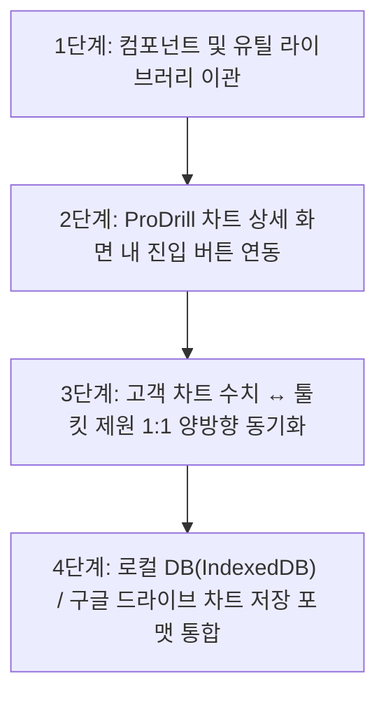

# 🛠️ ProDrill 툴킷 통합 탑재 기술 명세서 (Integration Blueprint)

> **문서 목적**: 독립 웹앱(`drilling-tools-app`)으로 고도화 완료된 **스판 변환기, 오발 계산기, 초정밀 2D 오발 지공도면 시뮬레이터**를 향후 메인 **ProDrill 지공 차트 관리 시스템**에 1:1로 원활하게 통합 탑재하기 위한 아키텍처, 데이터 계약(Data Contract), UI 연동 방안을 체계적으로 정리한 기술 문서입니다.

---

## 1. 📌 통합 대상 핵심 기능 및 컴포넌트 맵

| 모듈명 | 주요 기능 및 역할 | 소스 파일 위치 | ProDrill 차트 연동 포인트 |
| :--- | :--- | :--- | :--- |
| **스판 변환기**<br>`SpanConverter` | • 64분수 실시간 정밀 스판 변환<br>• 미드라인/엄지/중약지 컷오프 연산<br>• 마킹 가이드 직통 결과 모달 연계 | `src/components/SpanConverterView.jsx`<br>`src/components/SpanResultModal.jsx` | 고객 차트의 스판 수치(Thumb, Mid, Ring) 자동 불러오기 및 변환값 1:1 기입 |
| **오발 계산기 & 피치 매트릭스**<br>`OvalCalculator` | • 원홀/오발 제원 기반 피치 매트릭스 연산<br>• 기본(3)/정밀(5)/초정밀(7) 모드 및 비트 테이블<br>• 수치 스냅샷 및 정밀도 모드 100% 원형 보존 | `src/components/OvalCalculatorView.jsx`<br>`src/components/OvalResultModal.jsx` | 고객 차트의 엄지 오발 제원(Oval Size, Angle, Pitch) 동기화 |
| **초정밀 2D 오발 지공도면 시뮬레이터**<br>`Midline2DLayoutRenderer` | • 2D Canvas 기반 실시간 극세선 도면 렌더링<br>• D-Pad 4방향 미세 피치 조절기 (자유 드래그)<br>• **시뮬레이터 & 가이드오발 일체형 컨트롤러**<br>• 비트 추가 증설(최대 8개) 및 커스텀 오프셋<br>• 상향/하향(▲/▼) 180° 회전 및 핀치 줌(0.6x~5.0x) | `src/components/ui/Midline2DLayoutRenderer.jsx` | 차트 상세 화면 내 `[ 2D 도면 보기 ]` 풀스크린 포털 또는 인라인 뷰 연동 |
| **키패드 & 전용 입력기**<br>`FractionKeypad` | • 1/64, 1/32, 1/16 분수 전용 가상 키패드<br>• 오터치 방지 및 현장 한 손 터치 최적화 | `src/components/FractionKeypad.jsx`<br>`src/components/ui/KeypadField.jsx` | ProDrill 전체 분수 수치 입력 인터페이스 공통화 |

---

## 2. 🔌 데이터 인터페이스 (Data Contract)

ProDrill 고객 차트 데이터와 툴킷 모듈 간에 오가는 표준 데이터 교환 규격입니다.

```typescript
// 📌 ProDrill 차트 ↔ 툴킷 연동 표준 인터페이스
interface ToolkitSharedState {
  // 1. 스판 제원
  hand: 'right' | 'left';               // 손방향 (오른손 / 왼손)
  midSpanStr: string;                   // 중지 스판 (예: "4 1/4")
  ringSpanStr: string;                  // 약지 스판 (예: "4 3/8")
  thumbHoleCut: string;                 // 엄지 홀 컷 (예: "1/4")
  fingerHoleCut: string;                // 핑거 홀 컷 (예: "1/4")
  
  // 2. 오발 제원
  holeSize: string;                     // 원홀 크기 (예: "25/32")
  ovalSize: string;                     // 오발 크기 (예: "27/32")
  ovalAngle: string;                    // 오발 각도 (예: "45")
  cut1Size?: string;                    // #1 비트 수치
  cut2Size?: string;                    // #2 비트 수치
  
  // 3. 도면 및 매트릭스 설정 상태
  precisionMode?: 'basic' | 'detailed' | 'ultra'; // 정밀도 모드 (3/5/7드릴)
  bitCustomOffsets?: Record<number, { x: number; y: number }>; // 비트별 미세 오프셋
  bitCustomSizes?: Record<number, string>;                      // 비트별 개별 규격
  extraBitCount?: number;                                       // 추가 비트 수
  autoOpenOvalMatrix?: boolean;                                 // 메트릭스 즉시 오픈 여부
}
```

---

## 3. 🎯 2D 도면 시뮬레이터 최신 UI 하이라이트 (통합 시 필수 반영점)

1. **시뮬레이터 & 가이드오발 일체형 컨트롤러 패널**:
   - **디자인 언어**: D-Pad와 1:1 완벽한 패밀리룩(가로 폭 `165px / 145px`, 다크 글래스모피즘 `bg-slate-900/95`, `rounded-2xl`).
   - **D-Pad 스타일 세로 경계선**: `border-l border-slate-700/70`를 통해 시뮬레이터 영역과 가이드오발 램프 영역을 단정하게 구획.
   - **조작 방식**:
     - 메인 바디 탭: 화이트 램프 점등 및 **시뮬레이터 면 채우기 ON/OFF**.
     - 우측 램프 탭: 골드 램프 점등 및 **가이드오발(GUIDE OVAL) 타원선 ON/OFF**.
     - 독립 제어: 둘 다 동시 점등, 동시 소등, 개별 점등 100% 지원.
   - **자유 드래그 이동 (Free Drag & Move)**: 도면 위 원하는 위치 어디로든 자유 이동 가능.

2. **화면 꺼짐 자동 방지 (`useModalLock`)**:
   - Screen Wake Lock API를 통해 2D 도면 및 결과 모달이 열려 있는 동안 작업 현장에서 디바이스 화면이 꺼지지 않도록 잠금 유지.

3. **원홀 비트 표준 표기**:
   - 비트 목록 내 `#번호 원홀 (규격)` 형식으로 통일.

---

## 4. 🚀 단계별 통합 탑재 로드맵



1. **1단계 (컴포넌트 이관)**:
   - `drilling-tools-app/src/components/ui/Midline2DLayoutRenderer.jsx`, `OvalResultModal.jsx`, `SpanResultModal.jsx`, `FractionKeypad.jsx`를 ProDrill의 `src/components/tools/` 경로로 이관.
2. **2단계 (진입점 구성)**:
   - `ChartDetailView` 내 작업 도구 툴바에 **`[ 2D 오발 도면 ]`**, **`[ 스판 변환기 ]`** 빠른 실행 시트/모달 버튼 추가.
3. **3단계 (양방향 데이터 바인딩)**:
   - 고객의 기존 지공 차트 수치를 클릭 한 번으로 도면에 로드하고, 도면에서 시뮬레이션/조정한 오프셋 수치를 고객 차트 메모나 전용 피치 필드에 즉시 저장.
4. **4단계 (검증 및 테스트)**:
   - E2E 테스트(`playwright`)를 통해 차트 진입 ➔ 도면 조작 ➔ 스냅샷 저장 흐름 100% 무결성 검증.

---
*본 문서는 `ProDrill` 저장소의 공식 기술 자산으로 보존됩니다.*
